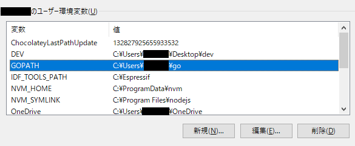

# SHOWROOM API 作成手順
### 実行環境
- Windows 10

# 1.Golangのインストール
> [公式ページ](https://go.dev/dl/)からダウンロード。  
ダウンロードしたファイルを実行してGoをダウンロードしてください。  
ダウンロード後、コマンドプロンプトでインストールが成功しているかを確認してください。
```
C:>go version
```
<br>



>環境変数にGOPATHが生成されているか確認してください。
>ここからはGOPATHのとおり`C:\Users\ユーザー名\go`で作業をしてください。

# 2.サーバー用ファイルの準備
>以下のようなディレクトリ構成にしてください。
>作成ファイルは以下に記載しています。コピーして作成してください。index.htmlはAPIの作者様のサーバーに飛びます。
```
src
└─yutons_server
  │    server.go
  │
  ├─public
  │    index.html
  │
  └─templates
       t009top.gtpl
```

<details><summary>index.html</summary>
    
```rb
<html>
    <head>
        <meta name="viewport" content="width=device-width, initial-scale=1.0">
        <style type="text/css">
            th,
            td {
                border: solid 1px;
            }
            table {
                border-collapse: collapse;
            }
        </style>
    </head>
    <body>
        <h2>
            <a href="https://zenn.dev/chouette2100/books/d8c28f8ff426b7">SHOWROOMのAPI、その使い方とサンプルソース</a>
        </h2>
        <table border="1">
            
            <tr style="text-align: center">
                <td>実行</td>
                <td>ソース（github）</td>
                <td>記事</td>
                <td style="width: 30%">備考</td>
            </tr>
            
            <tr>
                <td></td>
                <td>
                    <a href="https://github.com/Chouette2100/srapi">https://github.com/Chouette2100/srapi</a>
                </td>
                <td></td>
                <td style="width: 30%">SHOWROOMのAPIを駆動するための関数を集めたパッケージです。</td>
            </tr>
            
            <tr>
                <td></td>
                <td>
                    <a href="https://github.com/Chouette2100/exsrapi">https://github.com/Chouette2100/exsrapi</a>
                </td>
                <td></td>
                <td style="width: 30%">SHOWROOMにかかわるプログラムを作るために必要な基本的な関数を集めたパッケージです。
                <td>
            </tr>
            
            <tr>
                <td></td>
                <td>
                    <a href="https://github.com/Chouette2100/srhandler">https://github.com/Chouette2100/handler</a>
                </td>
                <td></td>
                <td style="width: 30%">Webサーバー/CGI版でのハンドラーを集めたパッケージです。</td>
            </tr>
            
            <tr>
                <td>
                    <a href="https://chouette2100.com:8443/cgi-bin/SC1/SC1/top">ShowroomCGI</a>
                </td>
                <td>笑われたらどうしよう、バカにされたらどうしよう、と思うと公開できません。 <br>
                    根がお豆腐メンタルなもんで w<br>
                    どなたか背中を押してください www</td>
                <td>
                    <a href="https://zenn.dev/chouette2100/books/d8c28f8ff426b7/viewer/84023c">SHOWROOMのAPIで何ができるか？</a>
                </td>
                <td style="width: 30%">SHOWROOMのAPIを使ったら何ができるか？ということでいろんなAPIを使って実際に作ったもの公開します。<br>
                    イベントでの配信者さんの獲得ポイントを取得し、いろいろな切り口で表示します。アクセス数がそんなに多くなさそうなので管理機能的なところも含めてご自由にお遊びください。
                </td>
            </tr>
            
            <tr>
                <td>
                    <a href="https://chouette2100.com:8443/cgi-bin/test/t009srapi/t009top">t009srapi</a>
                </td>
                <td>
                    <a href="https://github.com/Chouette2100/t009srapi/blob/main/t009srapi.go">t009srapi.go</a><br>
                    <a href="https://github.com/Chouette2100/srhandler/blob/main/HandlerT009topForm.go">HandlerT009topForm.go</a><br>
                    <a href="https://github.com/Chouette2100/srhandler/blob/main/HandlerT008topForm.go">HandlerT008topForm.go</a>
                </td>
                <td>
                    <a href="https://zenn.dev/chouette2100/books/d8c28f8ff426b7/viewer/06665d">【応用例】Web版・星集め・種集め対象のルームの一覧を作成する</a>
                </td>
                <td style="width: 30%">実行時点での配信ルームを開始時刻が最近のものからならべてもの（＝星集め・種集め対象ルーム）です。<br>
                    以下のt008のエントリーも含みます。
                </td>
            </tr>
            
            <tr>
                <td>
                    <a href="https://chouette2100.com:8443/cgi-bin/test/t009srapi/t008top">t008srapi</a>
                </td>
                <td>
                    <a href="https://github.com/Chouette2100/t008srapi/blob/main/t008srapi.go">t008srapi.go</a>
                </td>
                <td>
                    <a href="https://zenn.dev/chouette2100/books/d8c28f8ff426b7/viewer/584462">【応用例】（開催中の）イベント一覧を作成する</a>
                </td>
                <td style="width: 30%">実行時点での開催中イベントリストを取得し表示するCGI/Webサーバーです。</td>
            </tr>
            <tr>
                <td><a href="https://chouette2100.com:8443/cgi-bin/test/t007srapi/top">t007srapi</a></td>
                <td><a href="https://github.com/Chouette2100/t007srapi/blob/main/t007srapi.go">t007srapi.go</a></td>
                <td><a href="https://zenn.dev/chouette2100/books/d8c28f8ff426b7/viewer/c5cab5">【Windows】Webサーバの簡単な作りかた</a></td>
                <td style="width: 30%">ソースはWebサーバもCGIも同じです。ここではCGIとして振る舞っています。表示されているデータはダミーです。</td>
            </tr>
            
            <tr>
                <td>　</td>
                <td></td>
                <td></td>
                <td style="width: 30%"></td>
            </tr>
            
            <tr>
                <td>　</td>
                <td></td>
                <td></td>
                <td style="width: 30%"></td>
            </tr>
            
            <tr>
                <td>　</td>
                <td></td>
                <td></td>
                <td style="width: 30%"></td>
            </tr>
        </table>
    </body>
    </html>
```
</details>


<details><summary>t009top.gtpl</summary>
    
```rb
<html>

<head>
    <meta name="viewport" content="width=device-width, initial-scale=1.0" charset="UTF-8">
    <style type="text/css">
        th,
        td {
            border: solid 1px;
        }

        table {
            border-collapse: collapse;
            /*
            width: 100%;
            */
        }
    </style>
</head>

<body>
    {{ $tn := .TimeNow }}

    <p>
    {{/*}}
    <br>
    (外部リンク)<br>
        <a href="https://zenn.dev/">Zenn</a> - <a
            href="https://zenn.dev/chouette2100/books/d8c28f8ff426b7">SHOWROOMのAPI、その使い方とサンプルソース</a></p>
   <div style="text-indent: 2rem;"><a href="https://chouette2100.com/">記事/ソース/CGI一覧表</a>　（証明書の期限が切れてしまっていました。2022年8月29日、有効な証明書に切り替えました）</div>
    <p>-------------------------------------------------------------</p>
    (サイト内リンク)<br>
    <div style="text-indent: 2rem;"><a href="t008top">t008:開催中イベント一覧</a></div>
    <p>-------------------------------------------------------------</p>
    {{*/}}
    <p>配信中ルーム一覧（{{ UnixTimeToYYYYMMDDHHMM $tn }}）</p>
    <form method="get" action="t009top">
        <div style="text-indent: 2rem;"><div>
        <div style="text-indent: 2rem;"><input type="submit" value="配信ルーム一覧をもう一度取得する">
        （<input type="radio" name="category" value="Official" {{ if eq .Category "Official" }}checked{{ end }}>公式　
        <input type="radio" name="category" value="Free" {{ if eq .Category "Free" }}checked{{ end }}>フリー　
        最近配信を始めたルームから <input type="text" name="maxnoroom" value="20" maxlength="2" type="number" size="2"></form> ルーム表示する ）</div>
    </form>
    <br>
    <table>
        <tr style="text-align: center">
            <td>ルームID</td>
            <td>ジャンル</td>
            <td>ルーム名</td>
            <td>開始</td>
            <td>視聴者</td>
        </tr>
        {{ range .Lives }}
        <tr>
            <td>{{ .Room_id }}</td>
            <td>{{ GidToName .Genre_id }}</td>
            <td><a href="https://www.showroom-live.com/r/{{ .Room_url_key }}" target="_blank" rel="noopener noreferrer">{{ .Main_name }}</a></td>
            <td>{{ UnixTimeToHHMM .Started_at }}〜</td>
            <td style="text-align: right">{{ Comma .View_num }}</td>
        </tr>
        {{ end }}
        <tr>
    </table>
    <p>
        {{ .ErrMsg }}
    </p>
    <br>
    <hr>
    <br>

</body>

</html>
        
```

</details>

<details><summary>server.go</summary>
    
```rb

package main

import (
	//	"io" //　ログ出力設定用。必要に応じて。
	"log"
	"net/http"
	"net/http/cgi"
	"os"
	"time"

	"github.com/Chouette2100/srhandler"
)

//Webサーバーを起動する。
func main() {

	//ログファイルの作成
	logfilename := time.Now().Format("20060102") + ".txt"
	logfile, err := os.OpenFile(logfilename, os.O_APPEND|os.O_CREATE|os.O_WRONLY, 0666)

	if err != nil {
		panic("cannnot open logfile: " + logfilename + err.Error())
	}
	defer logfile.Close()

	//	ログ出力を設定する。
	log.SetOutput(logfile)

	//	環境変数 SCRIPT_NAME を取得しrootPathとする。この環境変数が設定されていればCGIとして起動されている。
	//	SCRIPT_NAME が設定されていなければWebサーバーとして起動されている。
	rootPath := os.Getenv("SCRIPT_NAME")
	log.Printf("rootPath: \"%s\"\n", rootPath)

	//	URLに対するハンドラーを定義する。
	http.HandleFunc(rootPath+"/t009top", srhandler.HandlerT009topForm)

	httpport := "8080"

	if rootPath == "" {
		//	Webサーバーとして起動された時
		http.Handle("/", http.FileServer(http.Dir("public")))
		err = http.ListenAndServe(":"+httpport, nil)
	} else {
		//	cgiとして起動された時
		err = cgi.Serve(nil)
	}

	if err != nil {
		log.Printf("%s\n", err.Error())
	}
}

    
```

</details>
    
    
# 3.サーバーを起動
>以下のコマンドを実行します
```
    C:>go mod init
    C:>go mod tidy
    C:>go build server
```
>するとserver.exeファイルが同ディレクトリに生成されるので実行します。
>ブラウザでlocalhost:8080/t009topを入力するとルームのリストが表示されます。